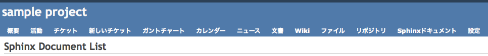

====================================
Redmine Sphinx Pluginの概要
====================================

本ツールは、以下の機能を提供するRedmineプラグインです。

機能
--------

* Redmine上でのSphinxドキュメントの表示
* リポジトリにアップロードされたSphinxドキュメントの自動コンパイル

注意事項
-----------------------

* 本プラグインを利用するためには、あらかじめRedmine上でプロジェクトの作成、およびリポジトリの設定を行っておく必要があります
* リポジトリ内のSphinx Makefileを検索し、makeを行うことで、ドキュメントのコンパイルをしています。
  Makefileが存在しない場合は、Sphinxドキュメントを正しく表示することができません。
* 現状では、Gitリポジトリ以外には対応していません

本プラグインの使い方
-------------------------

本プラグインをインストールすると、SphinxドキュメントのタブがRedmineのプロジェクトメニューバー上に表示されます(図1)。

図1: プロジェクトメニューバー上に追加されたSphinxドキュメントタブ

Sphinxドキュメントのタブをクリックすると、リポジトリ一覧が表示されます(図2)。

.. image:: image/sphinx_plugin.png
  :scale: 100%

図2: Sphinxドキュメントの一覧表示

ページ内のShow Documentリンクをクリックすると、リポジトリ内のsphinxドキュメントを自動的に探して表示します。

インストール方法
-----------------

本プラグインを利用するためには、あらかじめSettingslogicをインストールしておく必要があります。
Settingslogicは以下のコマンドでインストールすることができます。

.. code-block:: bash

  $ gem install settingslogic

本プラグインはgithubからダウンロードが可能です。適当なディレクトリに移動し、以下のコマンドを実行して
プラグインを取得してください。

.. code-block:: bash

  $ git clone git://github.com/nishio-dens/RedmineSphinxPlugin.git

取得したRedmineSphinxPluginディレクトリを、Redmineのプラグインディレクトリ内の vendor/plugins/ にコピーしてください。

その際、RedmineSphinxPluginディレクトリをredmine_sphinxに改名してください。

例えば、取得したプラグインディレクトリが/home/test/Download 内にあり、Redmineが /var/test/redmine にインストールされている場合、
以下のコマンドを実行してコピーを行ってください。

.. code-block:: bash

  $ cp -rf /home/test/Download/RedmineSphinxPlugin/ /var/test/redmine/vendor/plugins/redmine_sphinx

最後に、Redmine Sphinxプラグインの設定を行います。

設定ファイルのサンプルは、Redmine Sphinxプラグインディレクトリ内の、sample/sphinx_plugin_setting.yml.sampleに存在しています。

サンプル設定ファイルを、Redmineがインストールされているディレクトリ内の config/sphinx_plugin_setting.yml に設置してください。

.. code-block:: yaml

  defaults: &defaults
  
    server:
      #公開ディレクトリのルート
      document_root_path: /var/www/
      #ドキュメントを設置するディレクトリ名
      sphinx_dir: redminetest
      #html表示サーバのポート番号
      server_port: 80
  
    sphinx:
      sphinx_makefile_head: '# Makefile for Sphinx documentation'
      build_dir_variable_name: 'BUILDDIR'
      sphinx_index_page: index.html
  
  development:
    <<: *defaults
  
  test:
    <<: *defaults
  
  production:
    <<: *defaultsdefaults: &defaults
  

本プラグインでは、コンパイルしたsphinxドキュメントを、ウェブに公開されているディレクトリに設置して表示を行います。

document_root_pathには公開ディレクトリのルートパスを、sphinx_dirにはコンパイル済みsphinxドキュメント設置するディレクトリ名を指定してください。

以上で設定は完了です。

